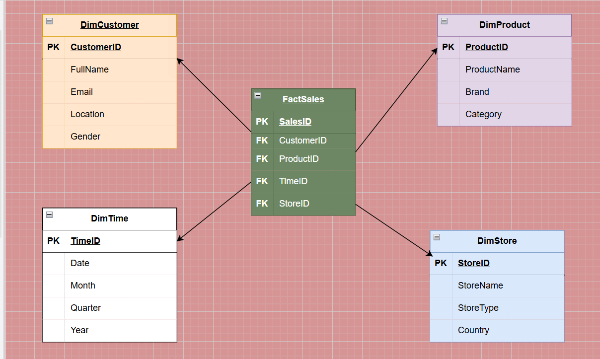

# DSA 2040 Practical Exam - Data Warehousing and Data Mining

 Student Name: [Paul Mbuvi]
Student ID: [984]
Submission Date: [8/14/2025] 


## Repository Structure

```
DSA-2040_PRACTICAL_EXAM_[Name]_[ID]/
├── Data Warehousing/
│   ├── schema_task/
│   │   ├── Retail_StarSchema_[ID].png
│   │   └── schema_creation.sql
│   ├── etl_task/
│   │   ├── etl_retail.py
│   │   ├── synthetic_retail_data.csv
│   │   └── retail_dw.db
│   └── olap_task/
│       ├── olap_queries.ipynb
│       ├── olap_analysis_report.md
│       ├── sales_by_country.png
│       └── Quarterly_trend.png
├── Data Mining/
│   ├── Preprocessing Task/
│   │   ├── preprocessing_iris.ipynb
│   │   ├── iris_processed.csv
│   │   ├── iris_train.csv
│   │   ├── iris_test.csv
│   │   ├── iris_pairplot.png
│   │   ├── iris_correlation_heatmap.png
│   │   └── iris_boxplots_outliers.png
│   ├── clustering_task/
│   │   ├── clustering_iris.ipynb
│   │   ├── iris_cluster_visualization.png
│   │   ├── iris_elbow_curve.png
│   │   └── clustering_analysis_report.md
│   └── classification_task/
│       ├── mining_iris.ipynb
│       ├── decision_tree_visualization.png
│       ├── classifier_comparison.png
│       ├── synthetic_transactions.csv
│       ├── association_rules_analysis.png
│       └── classification_detailed_report.txt
├── README.md
└── LICENSE
```

##  Project Overview

This repository contains my complete submission for the DSA 2040 End Semester Practical Exam covering Data Warehousing and Data Mining concepts.
The exam demonstrates practical skills in designing data warehouses, implementing ETL processes, and applying various data mining techniques.

##  Technologies Used

- **Python 3.x** with libraries:
  - pandas, numpy (Data manipulation)
  - scikit-learn (Machine learning)
  - matplotlib, seaborn (Visualization)
  - sqlite3 (Database operations)
  - mlxtend (Association rule mining)
- **SQLite** (Data warehousing)
- **Jupyter Notebooks** (Development environment)

### Data Warehousing
- **Option Selected:** [Synthetic Data Generation / UCI Online Retail Dataset]
- **Description:** [Brief description of chosen approach]
- **Size:** ~[X] rows, [Y] columns
- **Key Features:** InvoiceNo, StockCode, Description, Quantity, InvoiceDate, UnitPrice, CustomerID, Country

### Data Mining
- **Option Selected:** [Built-in Iris Dataset / Synthetic Data]
- **Description:** [Brief description of chosen approach]
- **Size:** 150 samples, 4 features, 3 classes
- **Features:** Sepal length/width, Petal length/width, Species

##  Section 1: Data Warehousing 

### Task 1: Data Warehouse Design 
 Objective: Design a star schema for a retail company data warehouse.
- Star Schema diagram


- I chose the star schema because it is simpler and easier to understand compared to the snowflake schema. All dimension tables are directly connected to the fact table, reducing the complexity of joins and improving query performance. This design also makes it easier for end users to navigate and analyze the data.

SQL Schema: Complete CREATE TABLE statements for fact and dimension tables


Why I chose Star schema over Snowflake -

- I chose the star schema because it is simpler and easier to understand compared to the snowflake schema. All dimension tables are directly connected to the fact table, reducing the complexity of joins and improving query performance. This design also makes it easier for end users to navigate and analyze the data.

### Task 2: ETL Process Implementation
 Implement complete ETL pipeline for retail data.

- I was able to generate 1000 rows of synthetic retail data


- Then I was able to confirm that this dataset was working


Key Features:

Comprehensive logging system
Error handling and rollback capability

### Task 3: OLAP Queries and Analysis 

  - Perform OLAP operations and analyze results.

- **Queries Implemented:**

  1. Roll-up: Total sales by country and quarter
  
  
  

  2. Drill-down: Monthly sales details for [specific country]
  
  

  3. Slice: Sales by product category
  
  

  # The Visualizations which I was able to Create
  ### Bar Chart of Sales by Country
  
  
  

  - From the Bar Graph above, we can say that Canada had the most sales than any other country.
  - Australia had the Most Sales Distribution by Country. 

### Quarterly Sales Trend


- From the analysis above, l can see that the sales were increasing from Q3 of 2023 to the highest point of Q4 2024 and then it died down in the several years

- **Key Insights:** [Brief summary of findings]

##  Section 2: Data Mining 

### Task 1: Data Preprocessing and Exploration

- Preprocess and explore the Iris dataset.


- **Data Source:** [Built-in Iris / Synthetic data]
- **Preprocessing Steps:**
  - Missing value handling
  - Feature scaling: Min-Max normalization
  - Train-test split: 80/20
- **Key Statistics:** [Brief summary of dataset characteristics]
- **Files:** `preprocessing_iris.ipynb`, processed data files, visualization images

### Task 2: Clustering
- **Algorithm:** K-Means clustering
- **Optimal k:** [Value] (determined via elbow method)
- **Performance:** Adjusted Rand Index = [X.XX]
- **Key Findings:** [Brief analysis of cluster quality]
- **Files:** `clustering_iris.ipynb`, cluster visualizations, analysis report

### Task 3: Classification and Association Rule Mining

#### Part A: Classification 
- **Models Compared:** Decision Tree vs [KNN/Other]
- **Best Performer:** [Model] with accuracy of [X.XX]%
- **Metrics:** Precision: [X.XX], Recall: [X.XX], F1-Score: [X.XX]

#### Part B: Association Rule Mining
- **Transaction Data:** [X] transactions with [Y] unique items
- **Parameters:** min_support=0.2, min_confidence=0.5
- **Top Rule:** [Example rule] (Support: X.XX, Confidence: X.XX, Lift: X.XX)
- **Business Insight:** [Brief interpretation]

 `mining_iris.ipynb`, transaction data, rule analysis

##  How to Run

### Prerequisites
```bash
pip install pandas numpy scikit-learn matplotlib seaborn mlxtend sqlite3
```

### Execution Order
1. **Data Warehousing:**
   ```bash
   # Create schema
   sqlite3 retail_dw.db < schema_creation.sql
   
   # Run ETL process
   python etl_retail.py
   
   # Execute OLAP analysis
   jupyter notebook olap_queries.ipynb
   ```

2. **Data Mining:**
   ```bash
   # Preprocessing
   jupyter notebook preprocessing_iris.ipynb
   
   # Clustering analysis
   jupyter notebook clustering_iris.ipynb
   
   # Classification and association rules
   jupyter notebook mining_iris.ipynb
   ```

##  Self-Assessment

### Completed Tasks (✓/✗)
- **Data Warehousing:**
  - [✓] Task 1: Star schema design and SQL creation
  - [✓] Task 2: Complete ETL pipeline implementation
  - [✓] Task 3: OLAP queries and visualization
  
- **Data Mining:**
  - [✓] Task 1: Data preprocessing and exploration
  - [✓] Task 2: K-means clustering with analysis
  - [✓] Task 3A: Classification model comparison
  - [✓] Task 3B: Association rule mining

### Challenges Faced
- [Challenge 1]: [Brief description and solution]
- [Challenge 2]: [Brief description and solution]

##  Notes

- All synthetic data generation includes reproducible seeds for consistency
- Code is thoroughly commented and follows modular design principles
- Error handling implemented for robust execution
- Visualizations saved in high-quality PNG format
- Database files included where size permits

## License

This project is submitted as part of academic coursework for DSA 2040. All work is original and completed independently.

---
